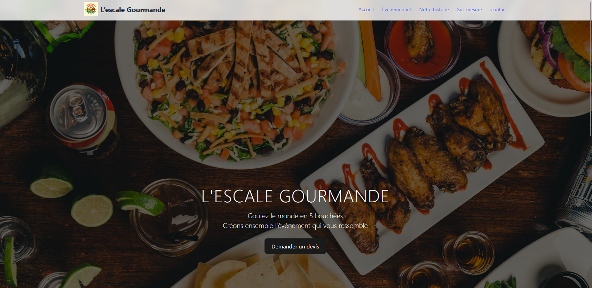

<a name="readme-top"></a>

<!-- PROJECT SHIELDS -->
[![Contributors][contributors-shield]][contributors-url]
[![Forks][forks-shield]][forks-url]
[![Stargazers][stars-shield]][stars-url]
[![Issues][issues-shield]][issues-url]
[![MIT License][license-shield]][license-url]
[![LinkedIn][linkedin-shield]][linkedin-url]

<!-- TABLE OF CONTENTS -->
<details>
  <summary>Table of Contents</summary>
  <ol>
    <li>
      <a href="#about-the-project">About The Project</a>
      <ul>
        <li><a href="#️-description">Description</a></li>
        <li><a href="#-planned-features">Planned Features</a></li>
        <li><a href="#️-built-with">Built With</a></li>
      </ul>
    </li>
    <li>
      <a href="#-getting-started">Getting Started</a>
      <ul>
        <li><a href="#-installation">Installation</a></li>
      </ul>
    </li>
    <li><a href="#-contributing">Contributing</a>
      <ul>
        <li><a href="#-license">License</a></li>
        <li><a href="#-contact">Contact</a></li>
      </ul>
    </li>
  </ol>
</details>

<!-- ABOUT THE PROJECT -->
# 🥗 About The Project

<p align="center">
  <a href="https://lescale-gourmande.netlify.app">
    
  </a>
</p>

<!-- DESCRIPTION -->
### ℹ️ Description

**L’escale gourmande** est une vitrine web moderne pour un service traiteur événementiel, proposant des prestations sur mesure pour particuliers & entreprises (cocktails, buffets, événements pros...).

- 🍽️ Design élégant & responsive
- 📱 Frontend en **Vue 3 / Nuxt 3** avec **Tailwind CSS**
- 🚀 Déploiement **Netlify**
- 📩 Formulaires de contact et demande de devis, notifications instantanées (email + Telegram)
- 🧑‍🍳 Présentation des services, chef, témoignages, contact, etc.

---

## 🚀 Planned Features

- [x] Landing page responsive, moderne et animée
- [x] Présentation des offres (cocktails, buffets, entreprise)
- [x] Formulaire intelligent (type d’événement, particulier/pro, nombre d’invités, etc.)
- [x] Envoi des demandes par email et Telegram
- [x] Animations (v-motion) et images Unsplash
- [ ] Blog ou actualités (à venir)
- [ ] Catalogue dynamique d’offres (MVP e-commerce)
- [ ] Dashboard d’administration (futur)
- [ ] SEO avancé

---

### 🏗️ Built With

* [![Vue.js][Vue.js]][Vue-url]
* [![Nuxt.js][Nuxt.js]][Nuxt-url]
* [![TailwindCSS][TailwindCSS.js]][TailwindCSS-url]
* [![Netlify][Netlify.com]][Netlify-url]

<p align="right">(<a href="#readme-top">back to top</a>)</p>

<!-- GETTING STARTED -->
# ✅ Getting Started

Ce projet utilise **Nuxt 3** (Vue 3), TailwindCSS et se déploie facilement sur Netlify.

### 💻 Installation

```bash
# 1. Clone le repo
git clone https://github.com/ton-utilisateur/lescale-gourmande.git
cd lescale-gourmande

# 2. Installe les dépendances
npm install

# 3. Lance le serveur de dev
npm run dev

# 4. Visite
http://localhost:3000
```

<p align="right">(<a href="#readme-top">back to top</a>)</p>


<!-- CONTRIBUTING -->
# 🙌 Contributing

We welcome all contributions! 🛠️ Whether it's fixing a typo, improving documentation, or suggesting a new feature — **every little bit helps**.

To contribute:
1. 🍴 Fork the repo
2. 🔧 Create a feature branch (`git checkout -b feat/my-feature`)
3. 💬 Commit your changes (`git commit -m "feat: add my feature"`)
4. 🚀 Push to your fork (`git push origin feat/my-feature`)
5. 📨 Open a pull request

Thanks a lot for your support! 💙

<p align="right">(<a href="#readme-top">back to top</a>)</p>


<!-- LICENSE -->
### 📄 License

This project is licensed under the **MIT License** 📜.
You're free to use, modify, and distribute it — just remember to give credit 🤝.

See the full license in [`LICENSE.txt`](https://en.wikipedia.org/wiki/MIT_License) for details.

<p align="right">(<a href="#readme-top">back to top</a>)</p>


<!-- CONTACT -->
### 📬 Contact

- 👤 [Linkedin][linkedin-url]
- 🐦 [@Nabil](https://twitter.com/Nabil71405502)
- 📧 na.labrazi@gmail.com
- 🔗 [Portfolio](https://nabil-labrazi.fr)
- 📁 [Project Repository](https://github.com/nlabrazi/lescale-gourmande)

<p align="right">(<a href="#readme-top">back to top</a>)</p>


<!-- MARKDOWN LINKS & IMAGES -->
[contributors-shield]: https://img.shields.io/github/contributors/nlabrazi/lescale-gourmande.svg?style=for-the-badge
[contributors-url]: https://github.com/nlabrazi/lescale-gourmande/graphs/contributors
[forks-shield]: https://img.shields.io/github/forks/nlabrazi/lescale-gourmande.svg?style=for-the-badge
[forks-url]: https://github.com/nlabrazi/lescale-gourmande/network/members
[stars-shield]: https://img.shields.io/github/stars/nlabrazi/lescale-gourmande.svg?style=for-the-badge
[stars-url]: https://github.com/nlabrazi/lescale-gourmande/stargazers
[issues-shield]: https://img.shields.io/github/issues/nlabrazi/lescale-gourmande.svg?style=for-the-badge
[issues-url]: https://github.com/nlabrazi/lescale-gourmande/issues
[license-shield]: https://img.shields.io/github/license/nlabrazi/lescale-gourmande.svg?style=for-the-badge
[license-url]: https://github.com/nlabrazi/lescale-gourmande/blob/master/LICENSE.txt
[linkedin-shield]: https://img.shields.io/badge/-LinkedIn-black.svg?style=for-the-badge&logo=linkedin&colorB=555
[linkedin-url]: https://linkedin.com/in/nabil-labrazi
[product-screenshot]: assets/image/screenshot.png
[Next.js]: https://img.shields.io/badge/next.js-000000?style=for-the-badge&logo=nextdotjs&logoColor=white
[Next-url]: https://nextjs.org/
[Rails.js]: https://img.shields.io/badge/rails-%23CC0000.svg?style=for-the-badge&logo=ruby-on-rails&logoColor=white
[Rails-url]: https://rubyonrails.org/
[React.js]: https://img.shields.io/badge/React-20232A?style=for-the-badge&logo=react&logoColor=61DAFB
[React-url]: https://reactjs.org/
[Ruby.js]: https://img.shields.io/badge/ruby-%23CC342D.svg?style=for-the-badge&logo=ruby&logoColor=white
[Ruby-url]: https://www.ruby-lang.org/en/
[Vue.js]: https://img.shields.io/badge/Vue.js-35495E?style=for-the-badge&logo=vuedotjs&logoColor=4FC08D
[Vue-url]: https://vuejs.org/
[Angular.io]: https://img.shields.io/badge/Angular-DD0031?style=for-the-badge&logo=angular&logoColor=white
[Angular-url]: https://angular.io/
[Svelte.dev]: https://img.shields.io/badge/Svelte-4A4A55?style=for-the-badge&logo=svelte&logoColor=FF3E00
[Svelte-url]: https://svelte.dev/
[Laravel.com]: https://img.shields.io/badge/Laravel-FF2D20?style=for-the-badge&logo=laravel&logoColor=white
[Laravel-url]: https://laravel.com
[Bootstrap.com]: https://img.shields.io/badge/Bootstrap-563D7C?style=for-the-badge&logo=bootstrap&logoColor=white
[Bootstrap-url]: https://getbootstrap.com
[JQuery.com]: https://img.shields.io/badge/jQuery-0769AD?style=for-the-badge&logo=jquery&logoColor=white
[JQuery-url]: https://jquery.com
[Javascript.js]: https://img.shields.io/badge/javascript-%23323330.svg?style=for-the-badge&logo=javascript&logoColor=%23F7DF1E
[Javascript-url]: https://developer.mozilla.org/en-US/docs/Web/JavaScript
[NodeJs.js]: https://img.shields.io/badge/node.js-6DA55F?style=for-the-badge&logo=node.js&logoColor=white
[NodeJs-url]: https://nodejs.org/en/
[TypeScript.js]: https://img.shields.io/badge/typescript-%23007ACC.svg?style=for-the-badge&logo=typescript&logoColor=white
[TypeScript-url]: https://www.typescriptlang.org/
[RxJS.js]: https://img.shields.io/badge/rxjs-%23B7178C.svg?style=for-the-badge&logo=reactivex&logoColor=white
[RxJS-url]: https://rxjs.dev/
[Netlify.com]: https://img.shields.io/badge/-netlify-blue?style=for-the-badge&logo=netlify&logoColor=green
[Netlify-url]: https://www.netlify.com/
[NestJs.io]: https://img.shields.io/badge/nestjs-E0234E?style=for-the-badge&logo=nestjs&logoColor=white
[NestJs-url]: https://nestjs.com/
[Nuxt.js]: https://img.shields.io/badge/Nuxt.js-00DC82?style=for-the-badge&logo=nuxtdotjs&logoColor=fff
[Nuxt-url]: https://nuxt.com/
[Prisma.io]: https://img.shields.io/badge/Prisma-3982CE?style=for-the-badge&logo=Prisma&logoColor=white
[Prisma-url]: https://www.prisma.io/
[Python.io]: https://img.shields.io/badge/python-3670A0?style=for-the-badge&logo=python&logoColor=ffdd54
[Python-url]: https://www.python.org/
[Railway.io]: https://img.shields.io/badge/Railway-000000?style=for-the-badge&logo=railway&logoColor=white
[Railway-url]: https://railway.app/
[Docker.io]: https://img.shields.io/badge/docker-2496ED?style=for-the-badge&logo=docker&logoColor=white
[Docker-url]: https://www.docker.com/
[PostgreSQL.js]: https://img.shields.io/badge/postgresql-316192?style=for-the-badge&logo=postgresql&logoColor=white
[PostgreSQL-url]: https://www.postgresql.org/
[TailwindCSS.js]: https://img.shields.io/badge/tailwindcss-06B6D4?style=for-the-badge&logo=tailwindcss&logoColor=white
[TailwindCSS-url]: https://tailwindcss.com/
[Stimulus.js]: https://img.shields.io/badge/stimulus-0a0a0a?style=for-the-badge&logo=stimulus&logoColor=white
[Stimulus-url]: https://stimulus.hotwired.dev/
